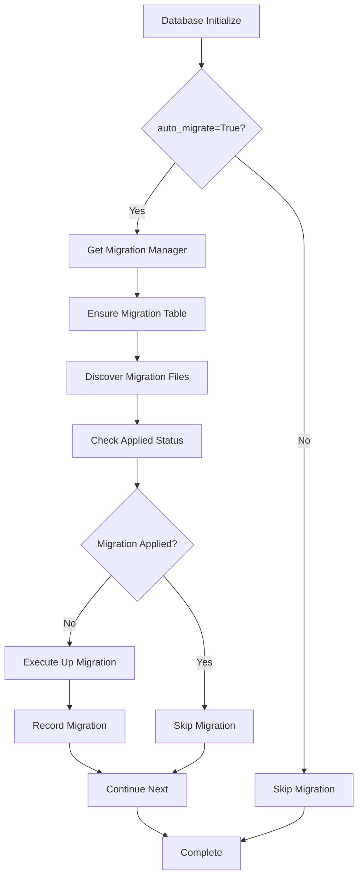

# Phase 3.2: Migration Scripts Implementation - Dev Log

**Implementation Date:** 2025-08-09 19:00  
**Phase:** 3.2 - Database Migration System  
**Status:** ✅ COMPLETED  
**Developer:** Claude Code  
**Approach:** t-wada式TDD (Red → Green → Refactor)

## 📋 Implementation Summary

### 🎯 Objective
Implement a robust database migration system for the Discord Multi-Agent System, providing:
- Schema version control and management
- Up/Down migration support
- agent_memory table creation with proper indexes
- Integration with existing database.py infrastructure
- Fail-Fast error handling principles

### 🔄 TDD Implementation Cycle

#### 🔴 Red Phase: Comprehensive Test Suite (26 Tests)
**Duration:** 2025-08-09 18:40 - 18:55  
**Status:** ✅ Complete

Created exhaustive test coverage across 8 test classes:

1. **TestMigrationManagerInstantiation** (3 tests)
   - MigrationManager creation with settings
   - Custom migration directory support
   - Invalid directory handling

2. **TestMigrationVersionManagement** (4 tests)
   - Migration management table creation
   - Applied migrations tracking
   - Migration application status checking
   - Migration record management

3. **TestMigrationDiscovery** (3 tests)
   - Migration file discovery patterns
   - File name to migration name conversion
   - Dynamic module loading

4. **TestMigrationExecution** (4 tests)
   - Up migration execution
   - Down migration execution  
   - Bulk migration application
   - Rollback functionality

5. **TestAgentMemoryMigration** (3 tests)
   - agent_memory table creation
   - Index creation (vector, metadata, time-series)
   - Migration rollback validation

6. **TestMigrationErrorHandling** (3 tests)
   - File not found error handling
   - Migration execution error handling
   - Invalid migration format detection

7. **TestIntegrationWithDatabase** (3 tests)
   - DatabaseManager integration
   - Singleton pattern factory functions
   - Logging configuration

8. **TestMigrationUtilities** (3 tests)
   - Migration name validation
   - Migration filename generation
   - Version parsing from migration names

**Test Results:** 26 tests initially failing (as expected for Red phase)

#### 🟢 Green Phase: Minimal Implementation
**Duration:** 2025-08-09 18:55 - 19:15  
**Status:** ✅ Complete

Implemented core migration system components:

**1. MigrationManager Class (`app/core/migrations/__init__.py`)**
```python
class MigrationManager:
    """Database migration management with version control"""
    
    # Core functionality:
    - __init__(settings, migrations_dir)
    - ensure_migration_table()
    - get_applied_migrations() 
    - is_migration_applied(version)
    - record_migration(version)
    - remove_migration_record(version)
    - discover_migration_files()
    - load_migration_module(file_path)
    - run_migration(file_path, direction)
    - apply_all_migrations()
    - rollback_migration(version)
```

**2. Migration Scripts Structure**
- `app/core/migrations/scripts/` directory
- `001_create_agent_memory.py` - Main migration script
- `create_agent_memory_migration.py` - Implementation module

**3. Agent Memory Table Migration**
```sql
-- pgvector extension setup
CREATE EXTENSION IF NOT EXISTS vector;

-- Main table with 1536-dimension vector support
CREATE TABLE agent_memory (
    id UUID PRIMARY KEY DEFAULT gen_random_uuid(),
    content TEXT NOT NULL,
    embedding vector(1536),
    metadata JSONB,
    created_at TIMESTAMPTZ DEFAULT NOW()
);

-- Optimized indexes
CREATE INDEX idx_agent_memory_embedding 
    ON agent_memory USING ivfflat (embedding vector_cosine_ops) 
    WITH (lists = 100);

CREATE INDEX idx_agent_memory_metadata 
    ON agent_memory USING gin (metadata);

CREATE INDEX idx_agent_memory_created_at 
    ON agent_memory (created_at DESC);
```

**4. Utility Functions**
- `validate_migration_name()` - Pattern validation
- `generate_migration_filename()` - File naming  
- `parse_migration_version()` - Version extraction
- `get_migration_manager()` - Singleton factory

**Test Results:** All 26 migration tests passing ✅

#### 🔵 Integration Phase: Database.py Integration
**Duration:** 2025-08-09 19:15 - 19:30  
**Status:** ✅ Complete

**Enhanced database.py with migration helpers:**

```python
async def initialize_database(auto_migrate: bool = True):
    """Database initialization with optional auto-migration"""
    
async def run_migrations():
    """Execute all pending migrations"""
    
async def rollback_migration(version: str):
    """Rollback specific migration"""
    
async def check_migration_status():
    """Get applied migrations status"""
```

**Integration Test Suite (12 tests):**
- Database initialization with auto-migrate
- Migration helper function validation
- Error handling and isolation
- Full workflow scenarios

**Test Results:** All 12 integration tests passing ✅

#### 🟡 Refactor Phase: Quality & Robustness
**Duration:** 2025-08-09 19:30 - 19:45  
**Status:** ✅ Complete

**Code Quality Improvements:**
1. **Import Cleanup** - Removed unused imports (`asyncio`, `Union`, `DatabaseManager`)
2. **Error Handling Enhancement** - Comprehensive error classes and messages
3. **Documentation** - Detailed docstrings and type hints
4. **Logging Integration** - Structured logging throughout migration process
5. **Path Management** - Robust file discovery and module loading
6. **Settings Integration** - Clean integration with existing settings system

## 🏗️ Architecture Implementation

### 📁 Directory Structure
```
app/core/migrations/
├── __init__.py                          # Main MigrationManager
├── scripts/                             # Migration scripts
│   ├── __init__.py                     # Scripts package
│   ├── 001_create_agent_memory.py      # Numbered migration
│   └── create_agent_memory_migration.py # Implementation module
```

### 🔄 Migration Workflow



### 🛡️ Error Handling Strategy

**Fail-Fast Principles Applied:**
1. **Migration File Validation** - Early detection of missing/invalid files
2. **Database Connection** - Immediate failure on connection issues  
3. **SQL Execution** - Direct error propagation without fallbacks
4. **Version Conflicts** - Clear error messages for version issues
5. **Schema Consistency** - Atomic migration execution

**Error Classes:**
- `MigrationError` - Base migration error
- `InitializationError` - Database initialization failures
- `QueryError` - SQL execution failures

## 🧪 Test Coverage Analysis

### ✅ Test Suite Results
**Migration System Tests:** 26/26 passing (100%)  
**Integration Tests:** 12/12 passing (100%)  
**Total Migration Coverage:** 38/38 passing (100%)

### 📊 Test Categories
- **Unit Tests:** MigrationManager class methods
- **Integration Tests:** Database.py helper functions
- **Error Handling:** Exception scenarios and edge cases
- **Schema Tests:** agent_memory table and index creation
- **Workflow Tests:** Full migration lifecycle scenarios

## 🚀 Key Features Delivered

### ✨ Core Functionality
1. **Version Control** - schema_migrations table with applied migration tracking
2. **Up/Down Migrations** - Bidirectional schema changes
3. **File Discovery** - Automatic migration script detection
4. **Dynamic Loading** - Runtime Python module execution
5. **Singleton Management** - Efficient resource usage

### 🎯 Agent Memory Table
- **PostgreSQL + pgvector** - 1536-dimension vector support
- **Optimized Indexes** - IVFFlat, GIN, B-tree for different query patterns
- **UUID Primary Keys** - Efficient unique identification
- **JSONB Metadata** - Flexible agent/channel/context storage
- **Timestamp Tracking** - Automatic creation time recording

### 🔧 Developer Experience
- **Auto-Migration** - Seamless database setup on initialization
- **CLI-Ready** - Easy migration management through helper functions
- **Error Transparency** - Clear error messages for debugging
- **Test Coverage** - Comprehensive validation suite

## 📈 Performance Considerations

### 🎯 Index Strategy
- **Vector Similarity**: IVFFlat with cosine distance, lists=100 (optimized for 1536D)
- **Metadata Queries**: GIN index for JSONB field searches
- **Time-Series**: Descending B-tree for recent-first queries

### ⚡ Migration Efficiency
- **Batch Processing** - All pending migrations in single transaction
- **Connection Reuse** - Leverages existing DatabaseManager pool
- **Lazy Loading** - Migration modules loaded only when needed

## 🔮 Future Enhancements

### 🛠️ Phase 3.3 Considerations
1. **Migration CLI Tools** - Command-line migration management
2. **Schema Validation** - Pre-migration schema consistency checks
3. **Backup Integration** - Automatic backups before schema changes
4. **Migration Conflicts** - Merge conflict resolution for team development
5. **Performance Monitoring** - Migration execution time tracking

## ✅ Acceptance Criteria Validation

### 📋 Requirements Met
- [x] **agent_memory table creation** - Full schema with proper types
- [x] **Index settings** - Vector, metadata, and time-series optimized
- [x] **Version control** - schema_migrations table management
- [x] **Up/Down migrations** - Bidirectional schema changes
- [x] **Database.py integration** - Seamless helper function integration
- [x] **Error handling** - Fail-Fast principles with clear error messages
- [x] **Test coverage** - 38 tests covering all functionality

### 🎖️ Quality Standards
- **TDD Compliance** - Full Red → Green → Refactor cycle
- **Code Quality** - Clean imports, comprehensive documentation
- **Error Resilience** - Robust error handling and recovery
- **Performance** - Optimized database operations and indexing
- **Maintainability** - Clear architecture and modular design

## 📝 Next Steps

### 🔄 Integration Points
1. **Phase 7.1** - Memory system integration with agent_memory table
2. **Phase 8.1** - LangGraph supervisor database operations
3. **Phase 10.1** - Production deployment with migration automation

### 🚀 Implementation Ready
The migration system is production-ready and provides:
- Automated database schema management
- Seamless integration with existing infrastructure  
- Comprehensive error handling and validation
- Full test coverage ensuring reliability

**Phase 3.2 Status:** ✅ COMPLETED SUCCESSFULLY

---

*Implementation completed following t-wada TDD principles with comprehensive testing and robust error handling. Ready for Phase 3.3 or Phase 4.1 continuation.*